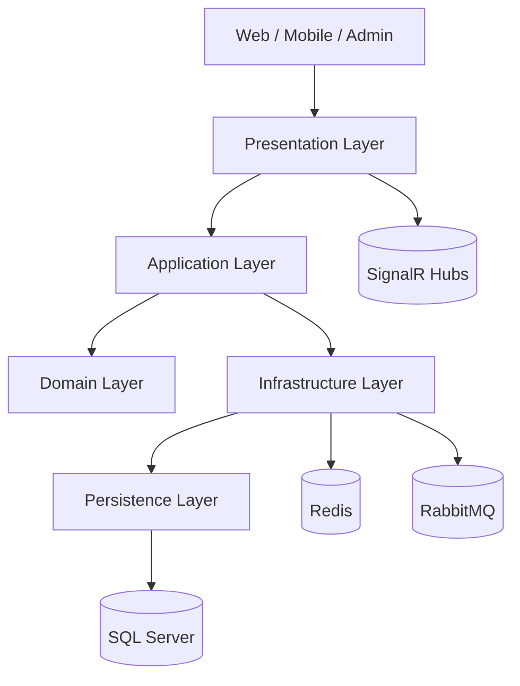

# Architecture

## Layer Responsibilities

- Domain: core business rules and invariants.
- Application: CQRS commands, queries, validation, orchestration, and port abstractions.
- Infrastructure: external services and integrations.
- Persistence: EF Core data access, repositories, unit of work, and migrations.
- Presentation: HTTP API, middleware, versioning, Swagger, and hubs.
- Shared: cross-cutting contracts, result types, constants, and helpers.

## Runtime Flow

1. The API receives a request in Presentation.
2. MediatR dispatches the command or query into Application.
3. Application enforces validation and coordinates domain behavior.
4. Infrastructure performs external operations.
5. Persistence writes and reads the SQL Server model.