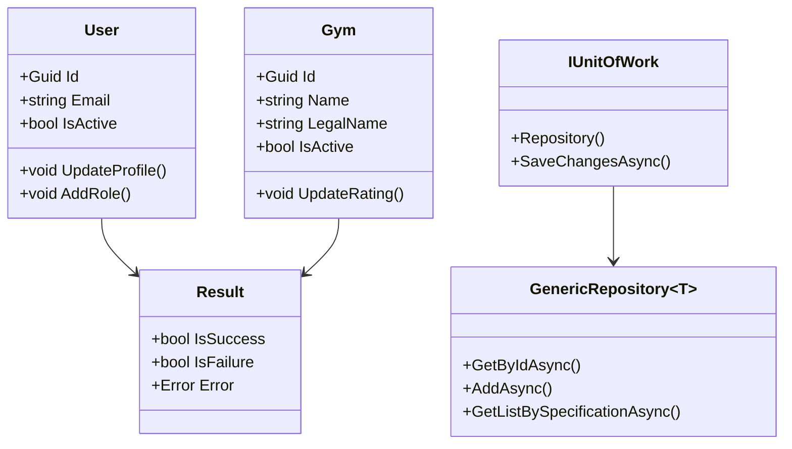

# Class Diagrams

```mermaid
classDiagram
    class Result {
        +bool IsSuccess
        +bool IsFailure
        +Error Error
    }

    class User {
        +Guid Id
        +string Email
        +bool IsActive
        +void UpdateProfile()
        +void AddRole()
    }

    class Gym {
        +Guid Id
        +string Name
        +string LegalName
        +bool IsActive
        +void UpdateRating()
    }

    class IUnitOfWork {
        +Repository<T>()
        +SaveChangesAsync()
    }

    class GenericRepository~T~ {
        +GetByIdAsync()
        +AddAsync()
        +GetListBySpecificationAsync()
    }

    User --> Result
    Gym --> Result
    IUnitOfWork --> GenericRepository~T~
```