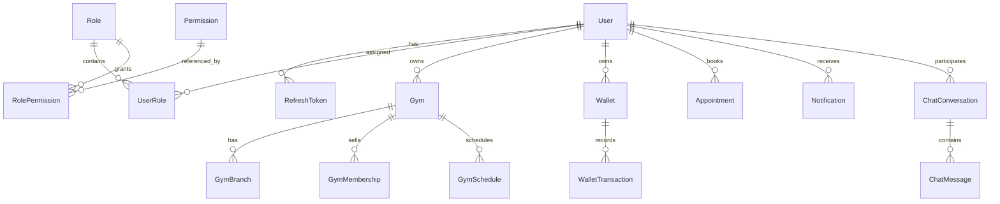

# ERD

## Notes

- Soft-delete entities are filtered by query filters in EF Core.
- Auditable entities carry creation and update metadata.
- Optimistic concurrency is enforced where configured in entity mappings.