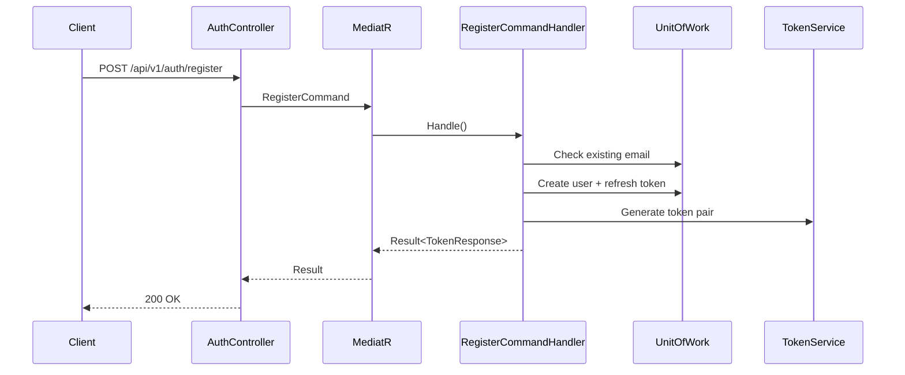
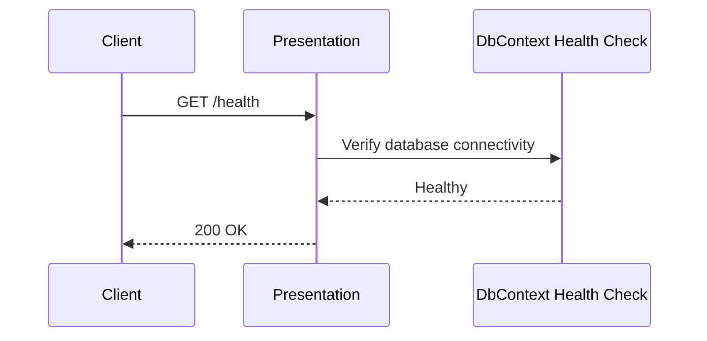

# Sequence Diagrams

## Register User

```mermaid
sequenceDiagram
    participant C as Client
    participant A as AuthController
    participant M as MediatR
    participant H as RegisterCommandHandler
    participant U as UnitOfWork
    participant T as TokenService

    C->>A: POST /api/v1/auth/register
    A->>M: RegisterCommand
    M->>H: Handle()
    H->>U: Check existing email
    H->>U: Create user + refresh token
    H->>T: Generate token pair
    H-->>M: Result<TokenResponse>
    M-->>A: Result
    A-->>C: 200 OK
```

## Get Health

```mermaid
sequenceDiagram
    participant C as Client
    participant P as Presentation
    participant D as DbContext Health Check

    C->>P: GET /health
    P->>D: Verify database connectivity
    D-->>P: Healthy
    P-->>C: 200 OK
```